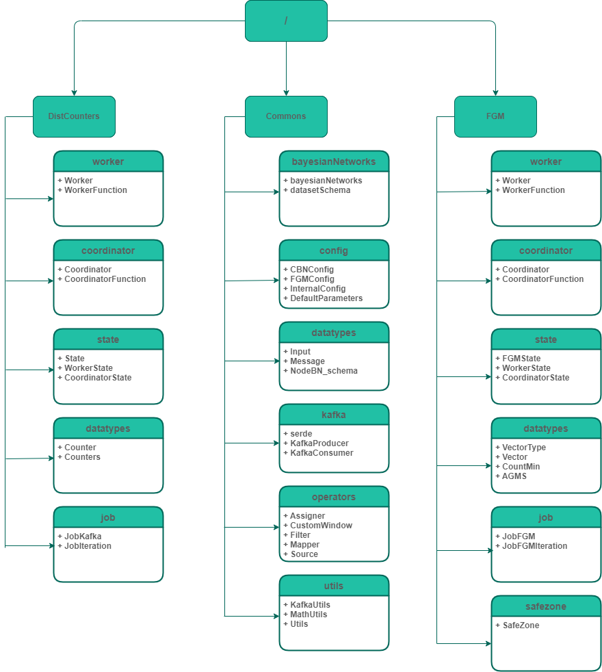
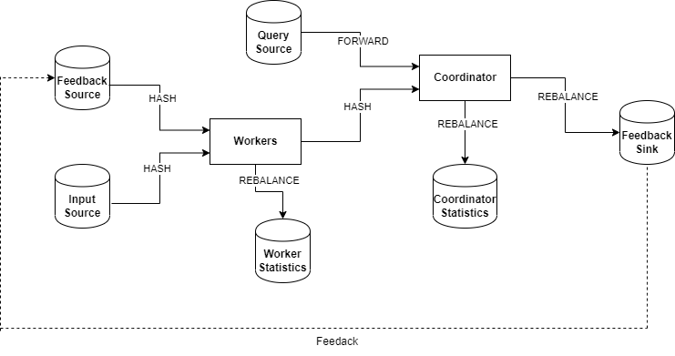

<p>

[](https://opensource.org/licenses/MIT?style=plastic) 
<a href="#!"></a>
<a href="#!"></a>
<a href="#!"></a>
<a href="#!"></a>

<a href="#!"></a>
<a href="#!"></a>
<a href="#!"></a>
<a href="#!"></a>

<!-- <a href="#!"></a> -->
<!-- <a href="#!"></a> -->

<!--  -->

</p>

## Description

> Distributed and Online maintenance of Bayesian Networks

<p style="text-align: justify">

We implement a general, extensible and scalable system for the online maintenance of the well-known graphical model, the **Bayesian Network(BNs)**, and a special of this the **Naïve Bayes Classifier** in **Apache Flink** platform. We focus on the learning parameters of the Bayesian Network using the **Maximum Likelihood Estimation (MLE)** algorithm. 

The first objective is to accurately estimate the **joint probability distribution** of the Bayesian Network while providing user-defined error guarantees. The second objective focuses on using the minimum communication cost and at the same time implementing a system capable of scaling and handling high-dimensional, distributed, high-throughput, and rapid data streams. To solve this problem there are two approaches. The first approach uses approximate distributed counters, we implement two types of distributed counters, the first type refers to the **Randomized Counters(RC)** and the second one refers to the **Deterministic Counters(DC)**. The second approach is based on the use of the **Functional Geometric Monitoring(FGM)** [[1]](http://users.softnet.tuc.gr/~minos/Papers/edbt19.pdf) method. 

The second approach resulted in an improvement of **100-1000x** in communication cost over the maintenance of exact MLEs and an improvement of **10-100x** in communication cost over the first approach, while providing estimates of joint probability distribution with nearly the same accuracy as obtained by exact MLEs.

</p>


## Project Structure

<p style="text-align: justify">

The structure of the project is organized in the following picture. In particular, there are three packages. The first package refers exclusively to the approximate distributed counters, the second package refers to the Functional Geometric Monitoring and the last one refers to the common parts that are used by both packages.

</p>




## The basic architecture



## Project Configuration

<p style="text-align: justify">
We use real-world Bayesian Networks from the repository [[2]](https://www.bnlearn.com/bnrepository/). The Bayesian Network structure used in this project is a JSON object. For adding both Bayesian Networks and Naïve Bayes Classifiers, first the network needs to be converted to a JSON object. The conversion can be done using the following project [[3]](#!).

This section contains details about all the available parameters which is needed to be setup and can be tweaked from the user to run a simple example from the whole pipeline of the job.
</p>


```
Distributed Counters Configuration

    Parameter: typeCounter
    Description: This parameter defines the type of counter that will be used as basic component during the process. There are four available types of counters: RANDOMIZED, DETERMINISTIC, CONTINUOUS and EXACT counter.


FGM Configuration

    Parameter:typeState
    Description: This parameter defines the type of state that will be used from both sides(workers-coordinator) during the process. There are three available types of state: VECTOR, AGMS and COUNT_MIN sketches[^notes].
    
    Parameter: enableRebalancing
    Description: This parameter enables/disables the rebalancing mechanism of the FGM protocol. Moreover, this parameter combines with the value of lambda. The default value of lambda is 2.

    
    Parameter: width, depth
    Description: These parameters are only valid if the type of state to be used is one of the available types of sketches. These parameters specify the width and the depth of the sketch to be used as the state of the Workers and Coordinator.


Common Configuration

    Parameter: typeNetwork
    Description: This parameter defines the type of network that will be used during the process. There are two available types of networks: BAYESIAN, NAÏVE

    Parameter: BNSchema
    Description: This parameter defines the network that will be used during the process. There are built-in network options that can be used. Here are some of the available network options: SACHS, ALARM, HEPAR2, LINK, MUNIN, and EARTHQUAKE.

    Parameter: datasetSchema
    Description: This parameter defines the schema of the datasets that will be used during the process. As in the case of the schema of the networks, there are built-in dataset schema options that can be used. Here are some of the available schemas options: SACHS, ALARM, HEPAR2, LINK, MUNIN, and EARTHQUAKE.

    Parameter: errorSetup
    Description: This parameter defines the algorithm that adjusts the error between the available counters. There are three options available the BASELINE, UNIFORM, and NON_UNIFORM algorithm.

    Parameter: workers
    Description: This parameter defines the number of workers/sites (not including the Coordinator) to be used during the process.

    Parameter: parallelism
    Description: This parameter defines the parallelism i.e. the number of subtasks that will be used by each pipeline operator during the process.

    Parameter: eps
    Description: This parameter specifies the epsilon value that defines the accuracy of the estimated joint probability distribution(user-defined error guarantees). 

    Parameter: delta
    Description: This parameter specifies the delta value that defines the likelihood of the estimated joint probability distribution(user-defined error guarantees). 

    Parameter: inputTopic
    Description: This parameter defines the Kafka topic that will be used as input to the Workers.

    Parameter: feedbackTopic
    Description: This parameter defines the Kafka topic that will be used as feedback loop between the Workers and the Coordinator.

```

<p style="text-align: justify">
Below we can see two complete examples of using the aforementioned parameters. The first example corresponds to the method of DistCounters and the second example corresponds to the method of FGM method.

In both examples, the dataset is the **HEPAR2** using **sourceHEPAR2** as inputTopic and **fdHEPAR2** as feedbackTopic. Furthermore, the number of workers that the distributed system will have is equal to **8** while the number of parallelism is equal to **4**. Finally, the accuracy is set to **0.1** and the likelihood of the estimated joint probability distribution is **90%**(error guarantees). 
</p>

```
DistCounters: The type of distributed counters that will be used is the RANDOMIZED type and the error schema is the algorithm BASELINE. 

--inputTopic sourceHEPAR2 
--feedbackTopic fdHEPAR2
--workers 8 
--parallelism 4 
--eps 0.1 --delta 0.1 
--errorSetup BASELINE 
--typeCounter RANDOMIZED 
--bn HEPAR2 --datasetSchema HEPAR2

```

```
FGM: The type of state that will be used is the VECTOR type and the error schema is the algorithms UNIFORM.

--inputTopic sourceHEPAR2 
--feedbackTopic fdHEPAR2 
--workers 8 
--parallelism 4 
--eps 0.1 --delta 0.1 
--errorSetup UNIFORM 
--typeState VECTOR 
--bn HEPAR2 --datasetSchema HEPAR2

```
